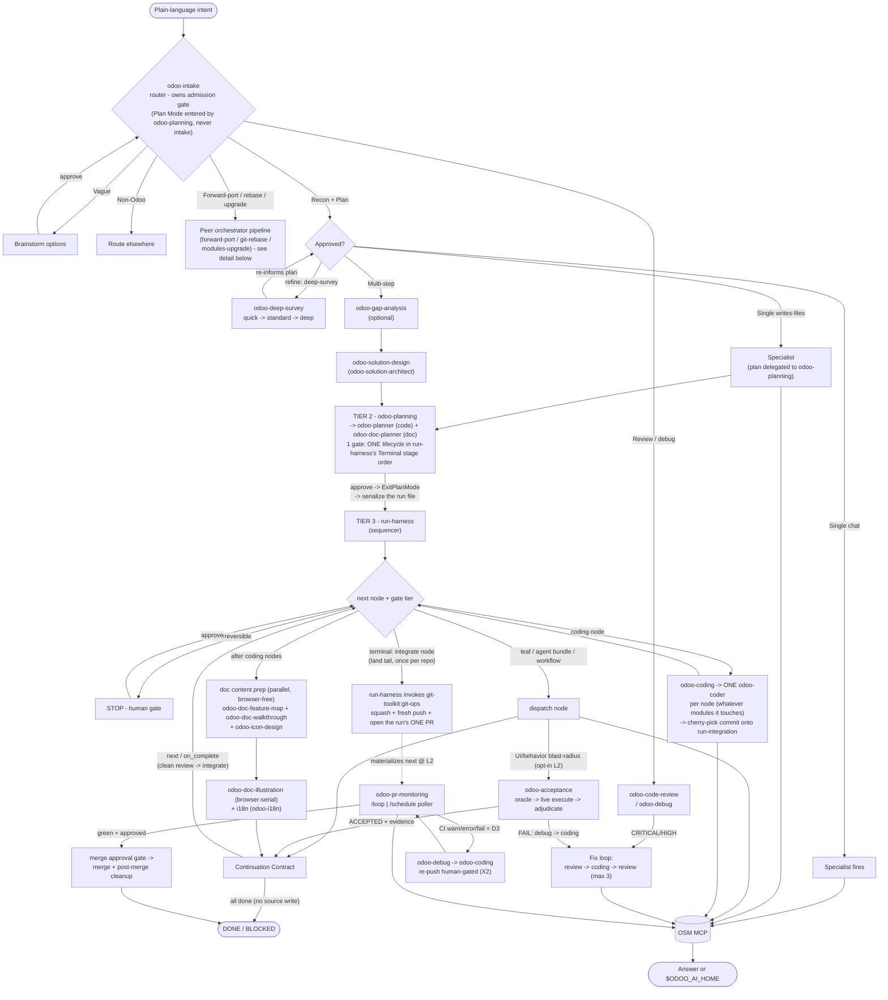
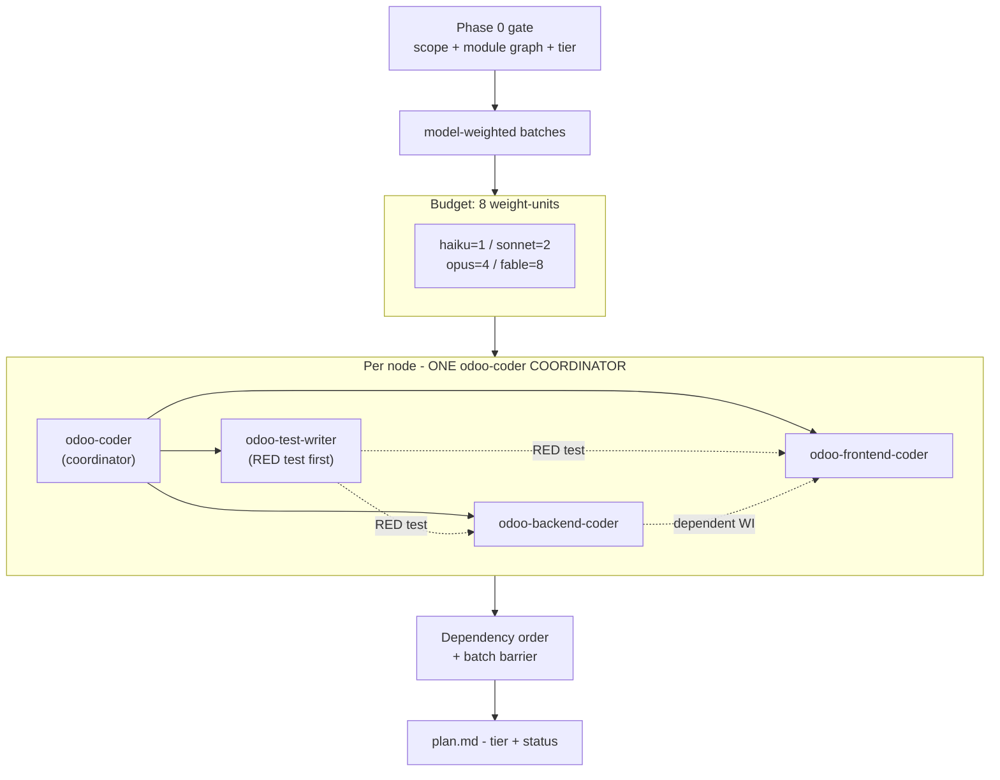
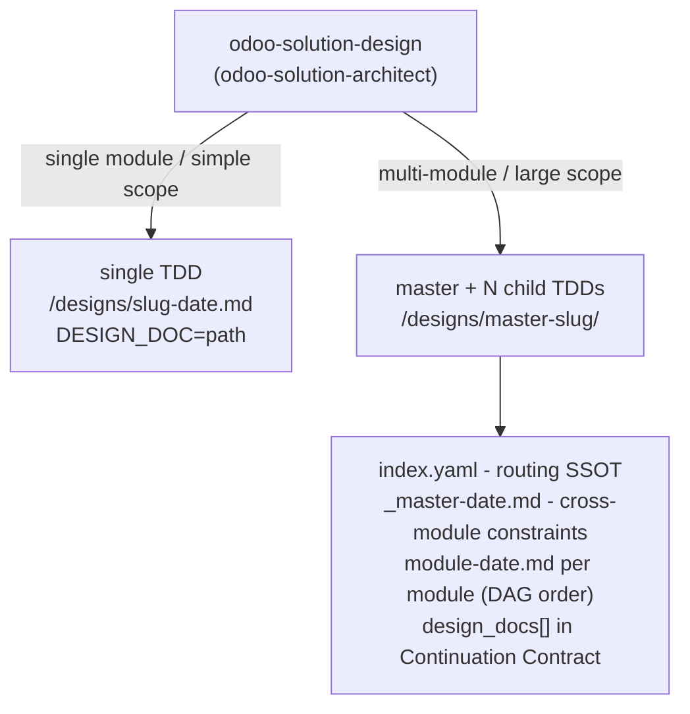
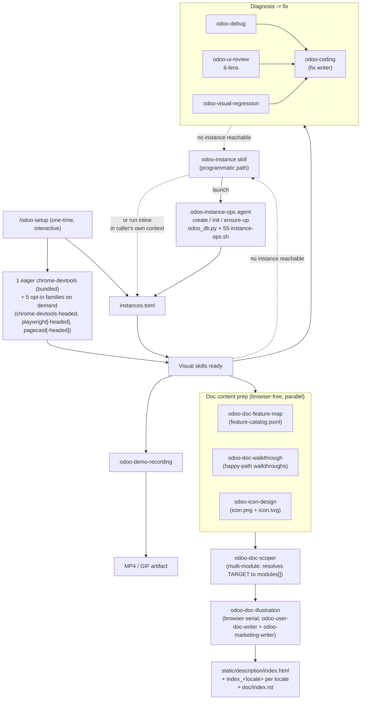
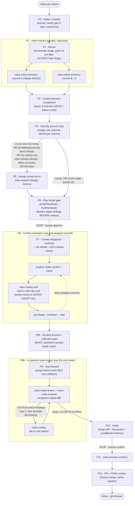
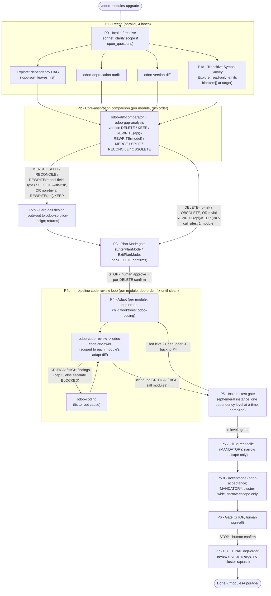
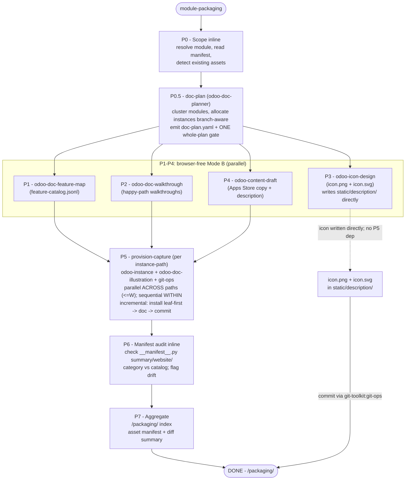
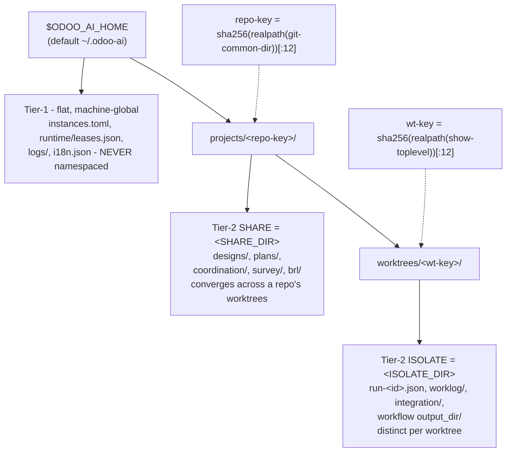

# Odoo AI Agent Team

> Plugin slug: `odoo-ai-agents`

[](../../LICENSE)
[](https://odoo-semantic.viindoo.com/)

> The Odoo AI workforce toolkit: **51 skills + 26 agents + 8 commands**, grouped into **9 persona
> buckets**, plus **13 declarative workflows** - covering engineering, coding, code review, visual
> UI testing, instance provisioning, pre-sales, sales, marketing, strategy, onboarding, and cross-version forward-porting. Installing this plugin pulls
> in the companion [`odoo-semantic-mcp`](../odoo-semantic-mcp/) plugin automatically (declared
> dependency), so all knowledge is grounded through the OSM MCP server. This repo is a thin
> routing and orchestration layer; computation lives on the server.

## What you get

Nine virtual specialists that self-activate from plain-language intent - no slash
commands to memorize. Describe what you need; the right persona fires automatically.
You do not need to know skill names.

`odoo-intake` is the universal front door. Say what you want in plain language and it plans the
whole job once, then drives it to done:
- **Vague intent** -> it brainstorms with you (clarifying options, no open-ended "what do you want?").
- **Clear single-step intent** -> it fast-paths straight to the matching specialist. A **review,
  PR-review, or debug** intent fast-paths to `odoo-code-review` / `odoo-debug` with no Plan Mode at
  all - and on a CRITICAL/HIGH finding that specialist **autonomously drives the fix** through
  `odoo-coding` and re-reviews to verify (review -> code -> review, bounded to 3 rounds then escalates).
- **Large / open-ended job** -> it can offer an opt-in **deep survey**, which you ask for by
  replying `refine: deep-survey` at the plan gate: a read-only, multi-phase
  pass (broad quick sweep -> narrow standard-depth dives -> optional deep pass) that writes a synthesis under
  `<SHARE_DIR>/survey/` (resolve `<SHARE_DIR>`/`<ISOLATE_DIR>` once per `${CLAUDE_PLUGIN_ROOT}/snippets/state-root-resolution.md`; substitute the captured absolute path - never write the placeholder or a bare `.odoo-ai/` into a Read/Write/Edit) and re-informs a sharper plan before any code is written.
- **Multi-step intent** -> it lays out a plan (the modules, their order, who does each), you
  approve once, and then it **advances step-to-step on its own** - dispatching each specialist,
  reading the result, and moving to the next - stopping only when a step is irreversible/outward
  (e.g. a git push or an email to a customer) or when it is blocked and needs you.

You control how hands-off this is with one optional flag (`--auto` is the default; see
[Drive to done](#drive-to-done-how-to-use-it)). No execution ever fires before you approve the
plan, and the main agent is never forced or trapped - the stops are real human checkpoints, the
nudges are advisory.

A first-class **forward-port pipeline** (`/odoo-forward-port`) is also included: a 13-phase
orchestration (P0-P12, with a mandatory P9.5 i18n sub-phase) that groups commits by MODULE first,
then by commit within it, and ports them across Odoo series using intent-first extraction (not raw
code carry-over), merge-keep-SHA strategy, symbol-survival checking, pre-adapt drift scan, adaptive
test forwarding, and verify-by-behavior per batch - at most one agent instance per module across
the whole run. It runs alongside coding, code review, and upgrade planning as a core engineering
capability.

> **Counts at a glance:** this plugin ships **51 skills + 26 agents + 8 commands**, grouped into
> **9 persona buckets** for navigation, plus **13 declarative workflows** driven by
> `workflows/*.workflow.yaml`. A further slash command, `/odoo-semantic-mcp:connect`, belongs to
> the companion `odoo-semantic-mcp` plugin and is pulled in automatically when you install this one.

## Who is it for

The `Domain` column cross-references the `domain` enum in `workflows/_schema.md` §3 (the
technical SSOT `hooks/detect-intent.sh` and every `*.workflow.yaml` classify against) - several
personas share one domain value where the underlying work is the same discipline (Engineer /
Coder / Code-Reviewer all `engineering`); `qa` and `support` are workflow-level domain values
(`qa-suite.workflow.yaml`, `support-triage.workflow.yaml`) without a dedicated top-level persona
row above.

| Persona | Domain | Key skills |
|---------|--------|-----------|
| Onboarding / Concierge | consultant | `odoo-intake` |
| Engineer | engineering | override-finding - deprecation-audit - forward-port / version-diff - git-rebase - modules-upgrade |
| Coder | engineering | odoo-coding - odoo-debug - solution-design |
| Code-Reviewer | engineering | odoo-code-review |
| Visual / UI QA | qa | ui-review - visual-regression - demo-recording - doc-illustration |
| Pre-Sales | presales | feature-check - gap-analysis - brl |
| Sales AE | sales | objection-handling - deal-followup - discovery-summary |
| Marketer | marketing | feature-highlights - content-draft - campaign-plan - icon-design - doc-feature-map - doc-walkthrough |
| Strategist / CEO | strategy | risk-overview - competitive-brief - customization-inventory |

- **Engineer** - Find the correct override point, audit deprecated API usage before an upgrade, or validate a deployment is safe.
- **Coder** - Write Odoo backend (Python/XML) or frontend (JS/OWL) code that is idiomatic and convention-correct, without looking up every framework rule.
- **Code-Reviewer** - Review pull requests or audit patches for ORM misuse, inheritance anti-patterns, security holes, or N+1 query issues.
- **Visual / UI QA** - Review a live Odoo screen through five lenses (aesthetics, function, stability, accessibility, performance), debug a broken render, catch visual regressions, record a demo clip, or run a full QA pipeline (test cases + checklist + bug triage).
- **Pre-Sales Consultant** - Verify feature availability, build a gap matrix, produce evidence for a proposal, compare CE vs EE side-by-side, or classify and cost hundreds of business requirements at scale with the BRL engine.
- **Sales AE** - Get ACA-structured responses to objections, risk-scored follow-up emails for stalled deals, a synthesized prospect profile from discovery notes, or triage an inbound support ticket into a customer-ready resolution draft.
- **Marketer** - Create content around Odoo features - blog posts, slide decks, social copy, multi-channel campaign plans - in marketing-ready language, and package a complete module for the Apps Store (icon, feature catalog, usage walkthroughs, illustrated landing) via `module-packaging`; individual skills: `odoo-doc-illustration`, `odoo-icon-design`, `odoo-doc-feature-map`, `odoo-doc-walkthrough`.
- **Strategist / CEO** - Get an executive risk overview of customizations, a structured customization inventory, or a competitor capability snapshot ready for a board or sales response.
- **Onboarding / Concierge** - Cross-cutting for every persona: `odoo-intake` takes ambiguous intent, brainstorms when vague, fast-paths when clear, resolves the Odoo series/profile/scope from your declared instance or checkout, routes to the right workflow or specialist, and always proposes a plan before any execution skill fires.

### How it works

Every agent - the main agent and every custom sub-agent - carries a shared universal **Work Ethos** (12 principles: completeness, root-cause, source-over-description, SSOT, and so on) loaded from `ODOO-AI-ETHOS.md` via a managed `@import` in your global `~/.claude/CLAUDE.md`.

Everything runs through the **main agent**, which acts as an **orchestrator + decision-maker
only** - it routes, decides at gates, and delegates the heavy work to specialists so its own
context stays clean across a long session. Roles: orchestrating context (main agent) ->
dispatched specialist (skill/workflow) -> named-agent interior worker (e.g. `odoo-coder`) or
fan-out leaf-worker. Multi-level nesting is supported up to a depth cap
(`CLAUDE_CODE_MAX_SUBAGENT_SPAWN_DEPTH`, default 3) - at the cap the agent-launch tool is silently
removed from the toolset, no error raised; `context: fork` fan-out workers additionally carry a
hard-rules line banning them from dispatching further spawner skills or subagents, on top of that
platform limit. Dispatch is capability-branching, not role-based - read your own toolset before
acting; SSOT `snippets/spawner-completion-contract.md` §R0. Orchestrator skills that dispatch
worker agents use the **Context-Handoff Protocol (CHP)** -
a 3-tier dispatch optimization (Tier A resume-a-child-you-launched / Tier B fork /
Tier C fresh spawn + worklog) whose SSOT is `snippets/context-handoff-protocol.md`. Resources
are platform-managed.

`odoo-intake` is the front door for any plain-language intent. It (1) closes an intent gate (what /
why / what-done), (2) resolves the Odoo series/profile/module scope from the instance you declared
with `/odoo-setup`, else derives them from the checkout (inline version/profile menu when OSM is
reachable but neither resolves), or asks you for the series + repo path when OSM is down - (3) runs
a quick read-only **recon** to make the plan context-aware, then (4) emits a **Proposed Plan** and
waits for your approval. From there:

- **Review / PR-review or debug intent** -> **fast-paths** straight to `odoo-code-review` /
  `odoo-debug`, skipping the planning ceremony (no Proposed-Plan block, no Plan Mode).
- **Single clear step** -> the one specialist fires; chat-only answers skip Plan Mode entirely.
- **Opt-in deep survey** (offered on large jobs as a separate question under the plan) -> reply
  `refine: deep-survey` and `odoo-deep-survey` fans out a broad quick sweep -> narrow standard-depth
  dives -> an optional deep pass and writes a synthesis
  under `<SHARE_DIR>/survey/` that re-informs a sharper Proposed Plan before any execution.
- **Multi-step** -> for non-trivial multi-module work the approved plan is authored by
  **`odoo-planning`** (via the `odoo-planner` agent) after `odoo-solution-design`: a flat DAG of work
  NODES (`depends_on` edges - no batch, layer, or grouping construct) that wires each node to a SKILL and spans the
  full lifecycle from code to merge, in the Terminal stage order constant `run-harness` owns
  (`skills/run-harness/references/run-integration.md` § Pre-PR tail - the order's ONE owner).
  `odoo-intake` serializes it to a run file (`<ISOLATE_DIR>/run-<id>.json`)
  and hands it to **`run-harness`** (the sequencer), which walks the
  nodes to `DONE` / `BLOCKED` / `NEEDS_CONTEXT`: pick the next node whose `depends_on` are all DONE
  -> check its gate tier -> dispatch it (a leaf skill inline, a coding/review/UI **agent bundle**, a
  declarative **workflow** via `workflow-chaining`, a coding node via **`odoo-coding`** - which
  dispatches ONE `odoo-coder` coordinator for that node, whatever modules it touches, and
  cherry-picks the returned commit onto the one run-level integration branch - or the terminal
  **`integrate`** land node that every `writes-files` plan ends on, once per repo, when every other
  node in that repo is terminal and a green verification node covers every module its coding nodes
  touched - `run-harness` invokes `git-toolkit:git-ops` to squash the integration branch, push it,
  and open the run's ONE PR against the principal branch) -> read the step's **Continuation
  Contract** -> advance. Once a PR is open the async
  poller **`odoo-pr-monitoring`** drives it to merge (watches CI + review; any failure routes to
  `odoo-debug` with the re-push human-gated; the merge approval gate). A step can chain the next one
  (including across workflows via `on_complete`), so the run keeps moving without re-prompting.

Each step carries a **gate tier** that decides what stops for you (see
[Drive to done](#drive-to-done-how-to-use-it)). Skills resolve the Odoo series, profile, and
addons path from the instance you declared with `/odoo-setup`, and derive them from the checkout
when none is declared, so a later skill never re-asks what an earlier one already resolved. Every
skill grounds its answers through the OSM MCP server; output is a direct answer or a file under
the `$ODOO_AI_HOME` state root.



_All agents (main + custom sub-agents) share a universal Work Ethos loaded from `ODOO-AI-ETHOS.md`; built-in Plan/Explore agents skip it by design._

### Drive to done - how to use it

Two dials decide how much the run does on its own and where it stops for you.

**1. Autonomy dial** (optional flag on your `/odoo-intake` request; default `--auto`):

| Flag | Behavior | Use when |
|------|----------|----------|
| `--auto` *(default)* | Drives the whole plan to done; stops only at irreversible/outward steps (**L2**) and when blocked | You want hands-off; you trust the approved plan |
| `--step` | Stops at **every** writes-files step for confirmation | High-stakes work; you want to inspect each change |
| `--plan` | Produces the plan (modules + order) and stops - runs nothing | You just want the plan/estimate |

**2. Gate tiers** - every step is tagged, and the tier (not the dial) is what ultimately decides
a human stop. **L2 always stops for a human; the dial can never lower it.**

| Tier | What it is | Under `--auto` |
|------|-----------|----------------|
| **L0** | Read-only / chat answers | Auto-passes |
| **L1** | Writes internal files under the `$ODOO_AI_HOME` state root (reversible, outside the repo) | Auto-passes |
| **L2** | Irreversible / outward: git push or merge, sending to a customer, touching a live instance - **and any source-code write that was not in the approved plan** | **Always stops for you** |

**Best practice.** Start with a plain-language `/odoo-intake "<what you want>"`. Approve the plan once.
Let `--auto` carry the routine steps; you will be stopped exactly at the moments that matter
(anything leaving your machine or touching a customer/instance). Use `--step` when you want to
watch every edit, `--plan` when you only want the map. You never type a skill name.

> **For contributors / AI agents extending this plugin:** the authoritative, diagram-backed
> spec of this whole mechanism - the Continuation Contract, the `run-<id>.json` blackboard, the
> gate-tier derivation, and the command/skill/agent taxonomy - lives in
> [`docs/reference/workflow-harness.md` §8](docs/reference/workflow-harness.md).
> The per-skill orchestration registry (spawn class, output mode, gate tier) is
> [`docs/reference/ORCHESTRATION-MAP.md`](docs/reference/ORCHESTRATION-MAP.md),
> generated from `generator/skill_tool_deps.json`. Read those before changing routing or gates.

### Coding dispatch and model tiers

When a coding job spans several nodes, `odoo-coding` assigns each node a **deterministic model
tier** at its Phase 0 gate - `haiku` (trivial boilerplate), `sonnet` (default, and the home of
large-but-single-domain work: Sonnet's ~1M-token context holds a big module plus its surroundings),
`opus` (reserved for multi-hard-domain changes entangled with many interacting modules - NOT chosen
for size alone), or `fable` (rare Custom-XL cross-module inheritance change, ~2x opus price,
design-doc-first) - recorded in the gate table and `plan.md`. It then dispatches **one `odoo-coder`
COORDINATOR per NODE** (whatever the node's stack tag - backend-only, frontend-only, or full-stack -
and whatever modules it touches: one, part of one, or several) as a
**subagent** in **model-weighted batches**: the coordinator splits its node into internal
work-items and, per work-item, launches its THREE teammates - `odoo-test-writer` FIRST (authors the
RED test, test-first), then `odoo-backend-coder` and/or `odoo-frontend-coder` to make it green (the
backend leg before a dependent frontend leg; the coders no longer author tests), nodes are ordered
so each runs after its `depends_on`, and each
round packs work up to a single model-weighted budget (the OOM envelope), whose SSOT is
[`skills/_shared/concurrency-guard.md`](skills/_shared/concurrency-guard.md):
WEIGHT `haiku=1 / sonnet=2 / opus=4 / fable=8`, at most **8 weight-units in flight** (so opus
throttles to 2 concurrent and fable runs exclusive). The plugin does NOT use the Claude Code
Workflow tool (JS) for codegen - all fan-out is real subagent launches.

The agent frontmatter `model:` is only a default - the dispatch `model` parameter overrides it per
work-item in either direction (same convention as `odoo-debug` and `odoo-solution-design`).



### Solution design decomposition

`odoo-solution-design` produces a flat single TDD (one module or simple scope) or a
master + N child TDDs (multi-module or large scope). Consumers resolve artifact paths from
the Continuation Contract - see
[`snippets/master-child-design-contract.md`](snippets/master-child-design-contract.md) for
the full schema and handoff fields.



## Workflows

The plugin ships 13 declarative workflows in `workflows/*.workflow.yaml`. Each workflow is
executed by the generic `workflow-chaining` skill, which reads the YAML and runs the declared
phase sequence with approval gates between phases. Adding a new workflow is a single YAML
file drop - no orchestration code required. A workflow may also declare an `on_complete`
transition (e.g. `qa-suite` -> `odoo-coding` when bugs are found); `run-harness` picks
that up and chains the next step across workflows automatically.

| Workflow | Trigger | Output dir |
|----------|---------|------------|
| `odoo-respond-bid` | Full bid / RFP response chain | `<ISOLATE_DIR>/bids/` |
| `odoo-implement-feature` | Requirement to shipped code with a design step (scope -> design -> code -> review) | `<ISOLATE_DIR>/implement/` |
| `odoo-plan-upgrade` | Comprehensive upgrade plan | `<ISOLATE_DIR>/upgrade-plans/` |
| `odoo-position-feature` | Positioning copy for marketing and sales | `<ISOLATE_DIR>/positioning/` |
| `discovery-pipeline` | Synthesize and structure discovery notes | `<ISOLATE_DIR>/discovery/` |
| `qa-suite` | Static release test-plan + QA checklist + bug triage (non-executing; live acceptance/oracle -> `odoo-acceptance`) | `<ISOLATE_DIR>/qa/` |
| `support-triage` | Classify + root-cause + draft resolution for a support ticket | `<ISOLATE_DIR>/support/` |
| `video-produce` | Multi-scene Odoo demo video (storyboard -> record -> assemble) | `<ISOLATE_DIR>/video/` |
| `sales-closing-cycle` | Late-stage sales cycle: objection handling + closing steps | `<ISOLATE_DIR>/sales/` |
| `ui-debug-session` | Resumable multi-turn UI debug with browser evidence | `<ISOLATE_DIR>/debug/` |
| `content-production` | Multi-asset content from a positioning brief | `<ISOLATE_DIR>/content/` |
| `research-multiphase` | Flexible-phase research: broad survey -> deep dives -> synthesis, model tier scaled per phase | `<ISOLATE_DIR>/research/` |
| `module-packaging` | End-to-end: scope -> doc-plan (branch-aware, 1 gate) -> feature-map/walkthrough/icon/copy fan-out (browser-free, parallel) -> provision-capture per instance-path (incremental, branch-aware) -> manifest-audit; output `<ISOLATE_DIR>/packaging/` | `<ISOLATE_DIR>/packaging/` |

Commands come in two shapes: multi-phase orchestrators that chain several skills in a
gated sequence, and single-step wrappers that run one skill and offer a save step.

| Command | Skill chain | Output |
|---------|------------|--------|
| `/odoo-respond-bid` | discovery-summary -> gap-analysis -> capability-proof -> objection-handling -> assemble | `<ISOLATE_DIR>/bids/` |
| `/odoo-position-feature` | feature-check -> addon-diff -> competitive-brief -> positioning | `<ISOLATE_DIR>/positioning/` |
| `/odoo-plan-upgrade` | risk-overview -> deprecation-audit -> version-diff -> synthesis | `<ISOLATE_DIR>/upgrade-plans/` |
| `/odoo-run-brl` | Gate 0 chunk plan -> classify + cost -> dependency DAG -> RTM + report | `<SHARE_DIR>/brl/` |
| `/odoo-draft-followup` | odoo-deal-followup (single step) | `<ISOLATE_DIR>/followups/` |
| `/odoo-summarize-discovery` | odoo-discovery-summary (single step) | `<ISOLATE_DIR>/discovery/` |
| `/odoo-produce-video` | odoo-demo-recording per scene | `<ISOLATE_DIR>/video/` |

The visual UI testing stack is a sibling cluster, not a linear chain: one `setup` step
provisions the browser environment, then four skills run independently and converge on
`odoo-coding` as the fix writer. When no reachable instance is detected, the visual
skills emit `NEEDS_NEXT -> odoo-instance` so a live instance can be provisioned
programmatically before the visual workflow resumes.



### Forward-port pipeline (`/odoo-forward-port`)

A 13-phase orchestration (P0-P12, with a mandatory P9.5 i18n sub-phase) that groups commits by
MODULE FIRST, then by commit within that module, and ports them across Odoo series using
intent-first extraction (not raw code carry-over), merge-keep-SHA strategy, symbol-survival
checking, pre-adapt drift scan, adaptive test forwarding, and verify-by-behavior per batch. At
most ONE agent instance is dispatched per module across the whole run for intent extraction (P1)
and, once resumed rather than cold-spawned, for code adapt (P8) - a module's whole picture lives
in one context instead of being split across N per-commit dispatches. Two human STOP-gates bound
the automation.

```mermaid
flowchart TD
    START(["/odoo-forward-port"])
    START --> P0["P0 - Recon + triage<br/>(read-only: enumerate commits,<br/>group by MODULE first,<br/>then by commit within it)"]

    subgraph P1_grp["P1 - Intent extract (parallel BY MODULE, read-only;<br/>at most ONE instance per module)"]
        P0 --> IE1["odoo-intent-extractor<br/>module A (its full ordered<br/>commit list, one instance)"]
        P0 --> IE2["odoo-intent-extractor<br/>module B...N (same)"]
    end

    IE1 --> P2["P2 - Classify + installable-probe<br/>(4-outcome bucket via OSM; installable from the<br/>target clean-tip manifest; prober for ambiguous cat-3)"]
    IE2 --> P2

    P2 -->|"bucket (c) complex"| P3["P3 - Design<br/>(route-out to odoo-solution-design;<br/>returns to forward-port)"]
    P3 --> P4_gate
    P2 -->|"bucket (a/b/d)"| P4_gate["P4 - Plan gate<br/>(EnterPlanMode / ExitPlanMode;<br/>plan.md written module-first as resume record)"]
    P4_gate -->|"STOP - human approve"| P5["P5 - Git merge --no-commit<br/>(keep SHA)"]

    P5 --> P6["P6 - Symbol-survival check<br/>(7 classes: field/method/model/<br/>test-base/import/installable/orm-field-key)<br/>+ test-survival sub-check"]
    P6 --> P7["P7 - Pre-adapt drift scan<br/>(Lane 1: ALL .py - import+pyflakes+orm-field-key<br/>Lane 2: tests-only collect gate)"]

    subgraph P8_grp["P8 - Adapt (test-first;<br/>ONE resumable worker<br/>per module across ALL its commits)"]
        P7 --> PA["8a forward tests RED-on-target<br/>(odoo-test-writer, launched once,<br/>resumed by the id its first launch returned)"]
        PA --> PB["8b adapt by bucket<br/>a=skip / b=3-way / c=reimplement / d=skip<br/>(odoo-coding -> odoo-coder, resumed<br/>the same way by WORKER_AGENT_ID)"]
        PB --> PC["migration rename gate + i18n compute<br/>(8e records i18n_due; no dispatch here)"]
    end

    PC --> P9["P9 - Verify by behavior<br/>(ephemeral instance, RED then GREEN,<br/>confirm-by-toggle per batch)"]
    P9 --> P95["P9.5 - i18n reconcile<br/>(MANDATORY, narrow escape only;<br/>reuses the P9 instance)"]
    P95 -->|"STOP - human confirm"| P10["P10 - Gate merge<br/>(commit + checkpoint;<br/>loop to P5 for next commit)"]
    P10 --> P11["P11 - End-to-end acceptance<br/>(odoo-acceptance) - MANDATORY<br/>cluster-wide, narrow-escape only<br/>runs BEFORE the P12 PR opens or its review runs"]
    P11 --> P12["P12 - PR + code-review<br/>(mandatory for new engines);<br/>pushes + opens the PR only after P11 acceptance<br/>and this phase's own diff-based review clear"]
    P12 --> DONE(["Done - <ISOLATE_DIR>/forward-port/"])
```



| Phase | Description | Parallel? | Human gate? |
|-------|-------------|-----------|-------------|
| P0 Recon + triage | Enumerate commits; inline-triage model tier; read-only | - | - |
| P1 Intent extract | Group commits by MODULE first (P0), then dispatch ONE odoo-intent-extractor per module - its full ordered commit list in one context, at most one instance per module for the whole run, never one per commit | Yes (N modules) | - |
| P2 Classify + installable-probe | 4-outcome bucket via OSM; installable read from the target clean-tip manifest; odoo-installable-prober for ambiguous cat-3 | Serial per commit | - |
| P3 Design | CONDITIONAL: route-out to odoo-solution-design for complex bucket-(c) modules; returns to forward-port | Serial per commit | - |
| P4 Plan gate | EnterPlanMode / ExitPlanMode; plan.md written module-first (each module's own commit list nested under it) as the resume record after approval | - | STOP - human approve |
| P5 Git merge --no-commit | Merge source commit onto target branch, keep SHA | Serial per commit | - |
| P6 Symbol-survival check | 7 classes (field/method/model/test-base/import/installable/orm-field-key) + test-survival sub-check | Serial per commit | - |
| P7 Pre-adapt drift scan | Lane 1: ALL .py (import+pyflakes+orm-field-key); Lane 2: tests-only collect gate | Serial per commit | - |
| P8 Adapt | Test-first per module; adapt by bucket (a=skip/b=3-way/c=reimplement/d=skip); migration dir retarget (C2) + i18n compute (8e records `i18n_due`, dispatch happens at P9.5); C1 no-bump / C3 source-bug gate | Serial per commit (the git merge stays one-commit-per-target-commit; the 8a test-adapt worker is launched once per module and resumed by the id that launch returned for every later commit touching it - 8b code-adapt closes the same way) | - |
| P9 Verify by behavior | Ephemeral instance, RED then GREEN, confirm-by-toggle per batch | Per-batch | - |
| P9.5 i18n reconcile | MANDATORY per batch for every module whose 8e record says `i18n_due: yes`, narrow escape only; reuses the P9 instance; dispatches `odoo-i18n` once (non-destructive: existing `.po` loaded before re-export, never blind-regenerate); gate folded into P10 | - | - |
| P10 Gate merge | STOP then commit + checkpoint; loop to P5 for next commit | - | STOP - human confirm |
| P11 End-to-end acceptance | Dispatch odoo-acceptance (Skill tool) ONCE for the whole batch; MANDATORY, cluster-wide, narrow-escape only; runs BEFORE P12 opens the PR or runs its review (same order as the sibling run-harness Pre-PR tail - the Terminal stage order constant, `skills/run-harness/references/run-integration.md` § Pre-PR tail) | - | L2 (human) - verdict carried into the P12 human-merge decision |
| P12 PR + code-review | Push + open PR only after P11 acceptance and this phase's own diff-based review clear; mandatory code-review for new engines; bot-comment cross-check runs post-PR (the one sub-step that genuinely needs an open PR) | - | - |

### Git-rebase pipeline (`/odoo-git-rebase`)

A 13-phase orchestration (P0-P12, with P8b and P9b sub-phases) that replays commits across Odoo
series using intent-aware conflict resolution, scale-conditional design before Plan Mode, an
in-pipeline code-review-and-fix loop after adapt, and a final pre-merge PR review. Two human
STOP-gates bound the automation; a third automated review gate (P9b) catches defects before verify.



Two review points are visible: the **P9b in-pipeline code-review loop** (fix-until-clean, right
after the adapt, before verify) AND the **P12 final PR review** (pre-merge). This is intentionally
more rigorous than forward-port (PR review only).

| Phase | Description | Parallel? | Human gate? |
|-------|-------------|-----------|-------------|
| P0 Intake / resolve | Clarify gate if open questions; read-only | - | - |
| P1 Recon | Enumerate range; patch-id pre-filter; EXTRACT-tier triage | - | - |
| P2 Intent extract | Dispatch odoo-intent-extractor per commit in rebase MODE | Yes (N commits) | - |
| P3 Cluster behavior comparison | Opus; 4-outcome a/b/c/d + failure mode per commit | - | - |
| P4 Classify | Assign one outcome a/b/c/d per commit (record only) | Serial per commit | - |
| P5 Design | CONDITIONAL: route-out to odoo-solution-design when non-trivial (see design-trigger table); returns | Serial per commit | - |
| P6 Plan Mode gate | EnterPlanMode / ExitPlanMode; decides adapt strategy BEFORE rebase starts | - | STOP - human approve |
| P7 Create integration worktree + rebase | Create worktree; git rebase --onto (rebase starts here) | - | - |
| P8 Conflict-resolution loop | Per stopped commit: explore conflict + intent; odoo-coding (owns the coder fan-out) resolves hunks to INTENT; git rebase --continue / --skip | Serial per commit | - |
| P8b Symbol-survival + collection gate | MUST run; autosilent symbol-break catch before test forward | - | - |
| P9 Test forward | Adapt branch tests RED then GREEN | - | - |
| P9b Code-review loop | In-pipeline: odoo-code-review -> odoo-code-reviewer scoped to adapt diff; fix via odoo-coding on CRITICAL/HIGH; cap 3 iterations; automated fix-until-clean | - | - |
| P10 Verify | Range-diff + dup-guard + conditional instance | - | STOP - human confirm |
| P11 Gate | Human-confirm gate | - | STOP - human confirm |
| P12 PR + FINAL review | Open PR; mandatory final code-review before human merge; never squash | - | - |

### Modules-upgrade pipeline (`/odoo-modules-upgrade`)

An 8-phase orchestration (P0-P7, with P1d, P2b, P4b, P5.7, and P5.8 sub-phases) that upgrades custom
Odoo modules (v8-v19) across a major version jump using dependency-ordered absorption,
scale-conditional design before Plan Mode, an in-pipeline per-module code-review-and-fix loop
after adapt, and a final pre-merge dep-order PR review. Two human STOP-gates bound the
automation; a third automated review gate (P4b) catches defects before the install/test pass.



Two review points are visible: the **P4b in-pipeline code-review loop** (per module, dep order,
fix-until-clean, right after the adapt, before the install/test gate) AND the **P7 final dep-order
PR review** (pre-merge). This is intentionally more rigorous than forward-port (PR review only).

| Phase | Description | Parallel? | Human gate? |
|-------|-------------|-----------|-------------|
| P0 Intake / resolve | Clarify scope if open questions; read-only | - | - |
| P1 Recon | Parallel (4 lanes): dependency DAG (topo-sort); odoo-deprecation-audit; odoo-version-diff; P1d transitive-symbol survey | Yes (4 lanes) | - |
| P1d Transitive Symbol Survey | (sub-phase of P1, parallel) Scans cluster for every symbol referencing external/core deps; grounds each at target; emits blockers[] used as preemptive fix list in P4 | Part of P1 | - |
| P2 Core-absorption comparison | odoo-diff-comparator + odoo-gap-analysis per module in dep order; emits verdict per module | Serial per module | - |
| P2b Hard-call design | CONDITIONAL: route-out to odoo-solution-design for MERGE / SPLIT / RECONCILE / REWRITE(model field-type) / DELETE-with-risk and non-trivial REWRITE(api)/KEEP; returns | Serial per module | - |
| P3 Plan Mode gate | EnterPlanMode / ExitPlanMode; per-DELETE confirmation before any file deletion | - | STOP - human approve |
| P4 Adapt | Per module in dep order; child worktrees; odoo-coding; P1d blockers[] prepended as preemptive fix list; manifest bump profile-gated | Serial per module | - |
| P4b Code-review loop | In-pipeline per module dep order: odoo-code-review -> odoo-code-reviewer scoped to each module's adapt diff; fix via odoo-coding on CRITICAL/HIGH; cap 3 iterations per module; automated fix-until-clean | Serial per module | - |
| P5 Install + test gate | Ephemeral instance; one dependency level at a time, green with demo=on (no separate framework-validation phase); red level loops back to P4 via debugger | Per level | - |
| P5.7 i18n reconcile | MANDATORY for every surviving module, narrow escape only (not gated on content diff - the `.pot`/`.po` tooling changes across a major series regardless); load existing .po into a fresh instance + re-export + git-ops diff-review (never blind-regenerate) | - | - |
| P5.8 Acceptance | Dispatch odoo-acceptance (Skill tool) ONCE for the whole cluster; MANDATORY, cluster-wide, narrow-escape only; verdict presented alongside the P6 sign-off | - | L2 (human) - combined with P6 sign-off |
| P6 Gate | Human sign-off after all levels green | - | STOP - human confirm |
| P7 PR + FINAL dep-order review | Open PR; Runbot parity gates + convention-compliance pass; mandatory final dep-order code-review; no cluster-squash (per-module consolidation to 1 clean commit per module allowed) | - | - |

### Module-packaging workflow (`module-packaging`)

End-to-end pipeline that packages a module for the Odoo Apps Store: scope inline, doc-plan (branch-aware, single whole-plan gate), browser-free content prep in parallel, then branch-aware per-instance-path provision-capture (incremental install -> doc -> commit), and a final manifest audit. P0.5 (`odoo-doc-planner`) clusters modules and allocates instances; after the gate, P1-P4 run fully in parallel; P3 (icon) writes directly to `static/description/` without waiting for P5, then commits via `git-toolkit:git-ops` per its Verify-then-commit step; P5 (`provision-capture`, fused) runs per instance-path - parallel across paths, sequential within - incremental install leaf-first then doc then git commit; P6 audits inline; P7 aggregates output under `<ISOLATE_DIR>/packaging/`.



| Phase | Description | Parallel? | Browser? |
|-------|-------------|-----------|----------|
| P0 Scope | Resolve module, read manifest, detect existing assets | - | - |
| P0.5 doc-plan | `odoo-doc-planner` -> cluster modules, allocate instances branch-aware, emit doc-plan.yaml; ONE whole-plan gate | - | - |
| P1 Feature-map | `odoo-doc-feature-map` -> feature-catalog.jsonl | Part of P1-P4 fanout | - |
| P2 Walkthrough | `odoo-doc-walkthrough` -> happy-path walkthroughs | Part of P1-P4 fanout | optional |
| P3 Icon | `odoo-icon-design` -> icon.png 256x256 + icon.svg, written directly to static/description/, then committed via git-toolkit:git-ops | Part of P1-P4 fanout (independent) | - |
| P4 Copy | `odoo-content-draft` -> Apps Store copy + description | Part of P1-P4 fanout | - |
| P5 provision-capture (FUSED) | `odoo-instance` + `odoo-doc-illustration` + `git-ops` per instance-path; incremental install leaf-first -> doc -> commit per module | Parallel ACROSS paths (<=W); sequential WITHIN | YES (per-path serial) |
| P6 Manifest audit | Inline: audit __manifest__.py summary/website/category vs catalog; flag drift | - | - |
| P7 Aggregate | Write <ISOLATE_DIR>/packaging/ index, asset manifest, diff summary | - | - |

### Available commands

> `/odoo-semantic-mcp:connect` ships in the `odoo-semantic-mcp` plugin and is not counted among the 8 commands of this plugin.

| Command | Purpose | Chained skills |
|---------|---------|----------------|
| `/odoo-respond-bid` | Full bid response chain for RFP/requirements documents, saves to `<ISOLATE_DIR>/bids/` | `odoo-discovery-summary` -> `odoo-gap-analysis` -> `odoo-capability-proof` -> `odoo-objection-handling` |
| `/odoo-draft-followup` | Sales follow-up email saved to `<ISOLATE_DIR>/followups/` | `odoo-deal-followup` |
| `/odoo-summarize-discovery` | Synthesize discovery notes into a structured profile, saves to `<ISOLATE_DIR>/discovery/` | `odoo-discovery-summary` |
| `/odoo-position-feature` | Positioning copy for marketing and sales use, saves to `<ISOLATE_DIR>/positioning/` | `odoo-feature-check` -> `odoo-addon-diff` -> `odoo-competitive-brief` -> positioning copy |
| `/odoo-plan-upgrade` | Comprehensive upgrade plan, saves to `<ISOLATE_DIR>/upgrade-plans/` | `odoo-risk-overview` -> `odoo-deprecation-audit` -> `odoo-version-diff` -> synthesis |
| `/odoo-run-brl` | Bulk requirement-list classification at scale (chunked, resumable), saves to `<SHARE_DIR>/brl/<job-id>/` | `odoo-brl` (sequential-outer-parallel-inner) |
| `/odoo-produce-video` | Multi-scene Odoo demo video (storyboard -> record -> assemble), saves to `<ISOLATE_DIR>/video/` | `odoo-demo-recording` (per scene) |
| `/odoo-ai-agents:odoo-setup` | One-shot idempotent setup for the visual workflow - wires the browser MCP families (one eager `chrome-devtools` + five opt-in) across Claude/Codex/Gemini, installs browser deps, auto-allows tool permissions, discovers + optionally spins up a local Odoo instance | - |

## Use cases - day in the life

### Use case 1 - Sales AE: stalled deal, draft a follow-up email in 30 seconds

A manufacturing SME prospect has not replied in 21 days after the demo. Pipeline stage is "evaluation." You need a follow-up email tonight to send tomorrow morning.

```
You: "Deal with Customer A stalled 21 days after demo, manufacturing SME evaluating
Odoo vs SAP. At the last meeting they promised technical feedback within the week.
Write a follow-up email."
```

Skill `odoo-deal-followup` fires. Output: risk score (red - warm lead, >14 days no reply), next-best-action ("re-engage with concrete value proof"), and a 4-paragraph follow-up email. To save it: `/odoo-draft-followup` chains the skill and writes to `<ISOLATE_DIR>/followups/customer-a-2026-MM-DD.md`.

### Use case 2 - Pre-Sales: RFP with 15 requirements

A prospect sends an RFP with 15 functional requirements: lot tracking, multi-level approval, reporting, multi-warehouse, customer portal, and more. You need a complete response within 24 hours.

```
You: "/odoo-respond-bid - Customer B (F&B chain, 50 locations), 15 requirements listed below"
```

The command runs a gated workflow: `odoo-discovery-summary` (prospect profile) -> `odoo-gap-analysis` (effort matrix: Standard / Config / Extension / Custom + S/M/L/XL days) -> `odoo-capability-proof` (evidence for covered items) -> `odoo-objection-handling` (2-3 anticipated objections) -> assemble proposal -> save to `<ISOLATE_DIR>/bids/customer-b-2026-MM-DD.md`. You approve each phase before the next fires.

### Use case 3 - Pre-Sales: BRL scoping for a large implementation

A prospect hands you a spreadsheet with 800 business requirements. You need a full implementation cost estimate, dependency ordering, and a requirement traceability matrix (RTM) before the proposal meeting.

```
You: "/odoo-run-brl - Customer C (retail chain), 800 requirements, Odoo 17, VN rates"
```

The BRL engine runs in a chunked pipeline (50 requirements per chunk): 4-way classification (CE / EE / Viindoo / Custom) with OSM evidence per item, deterministic cost lookup (no fabricated numbers), dependency DAG with Kahn topological sort, and phase-by-phase implementation sequencing. Two gates keep you in control - Gate 0 (approve chunk plan and cost config) and Gate E (approve deliverables before any file is written). Output: `rtm.csv` (Excel-ready RTM), `dag.mermaid` (implementation phases), `cost.json` (project budget roll-up with phase breakdown), and `report.md` (executive summary). The session is fully resumable: if interrupted, re-run the command and it picks up from the last completed chunk.

### Use case 4 - Strategist / founder: monthly board brief

You need a board status brief covering product progress, pipeline health, competitive landscape, and top risks before next week's investor meeting.

```
You: "Summarize competitive landscape - Competitor A vs your Odoo distribution -
for next week's board meeting."
```

Skill `odoo-competitive-brief` fires. It pulls competitor signals from context, the vault, or a web search (you can also supply them inline); the skill structures them into a market snapshot, capability matrix, GTM moves, threat assessment, and recommended product response - ready for a board deck. Combine with `odoo-risk-overview` (founder-level engineering risk dashboard) and `odoo-customization-inventory` (all custom modules with business purpose, M&A due-diligence ready).

### Use case 5 - Engineer + Coder: upgrade v15 to v17

Customer D is running Odoo 15 with 12 custom modules and wants to move to v17 in Q3.

```
You: "/odoo-plan-upgrade - Customer D, v15 to v17, 12 custom modules, deadline Q3"
```

Chains `odoo-risk-overview` -> `odoo-deprecation-audit` -> `odoo-version-diff` -> synthesis. Output: executive risk overview, code-level deprecation findings, API/feature diff, action ordering, S/M/L/XL effort estimate, and rollback plan. Saves to `<ISOLATE_DIR>/upgrade-plans/customer-d-v15-v17-2026-MM-DD.md`. When you need actual code written, invoke the `odoo-coding` skill (it owns the coder fan-out + model tier; OSM access).

### Use case 6 - Marketer: launch a new feature campaign

You just shipped a new inventory forecasting feature and need launch positioning plus ready-to-publish copy for blog, LinkedIn, and email.

```
You: "/odoo-position-feature - inventory forecasting module, target SME manufacturers,
launch window 2 weeks, main competitor SAP Business One"
```

The command chains `odoo-feature-check` (verifies the feature and reads its scope from OSM) -> `odoo-addon-diff` (CE vs EE edition framing) -> `odoo-competitive-brief` (how it lands against SAP B1) -> positioning synthesis. Output: a one-line value proposition, three proof points, objection rebuttals, and channel-by-channel copy. Saves to `<ISOLATE_DIR>/positioning/inventory-forecasting-2026-MM-DD.md`. For a full multi-week campaign blueprint, follow up with `odoo-campaign-plan`; for per-asset drafts (blog, email sequence, social), call `odoo-content-draft`.

### Use case 7 - QA / Visual: catch visual regressions after installing a module

Your team just installed a third-party module and you need to confirm no existing screens broke before handing off to the client.

```
You: "Run visual regression on the invoicing list and form views after installing
module account_followup on Customer E's staging instance."
```

Run `/odoo-ai-agents:odoo-setup` once to provision the browser automation stack. Then skill `odoo-visual-regression` fires: it captures before/after screenshots of targeted views, diffs them, and flags regressions with severity labels. Where a defect is confirmed, `odoo-ui-review` follows up with a 6-lens audit (aesthetics / function / stability / accessibility / performance / design-system + theme fidelity) and surfaces the exact CSS or XML path to fix. Fixes are handed to `odoo-coding`, which writes the override and shows a patch preview before applying.

### Use case 8 - Support: triage an inbound customer ticket

A customer reports that their invoice approval workflow is broken after a recent module update. You need to classify, root-cause, and draft a resolution note in one pass.

```
You: "Customer F reports: invoice approval button disappeared after installing
account_invoice_approval v14. Users are blocked."
```

Skill `odoo-support-triage` fires. It classifies the ticket (bug - UI regression), generates a root-cause hint using OSM to inspect the `account` module's approval flow and the installed module's view overrides, and drafts a resolution note ready to send to the customer. If a live browser is available, it NL-dispatches to `odoo-debug` to capture the console error and pinpoint the broken view. Output saved to `<ISOLATE_DIR>/support/customer-f-2026-MM-DD.md`.

### Frequently asked questions

**I only need one skill - do I have to know all 51?** No. Skills auto-fire by intent match. Describe what you need; the right skill triggers. `odoo-intake` acts as a brainstorm partner when you are not sure which skill to use.

**What if the OSM server is offline?** Each skill has a `## Standalone-first fallback` section - it degrades gracefully by reading your local codebase and your declared instance catalog directly (Read/Grep/WebFetch, three-tier grounding) instead of asking you to paste data; if a browser is genuinely unreachable a visual skill returns BLOCKED rather than requesting screenshots. The plugin does not break when OSM is offline.

**What about confidentiality?** Plugin code is public (MIT). Skills contain no customer-specific data or pricing. A pre-commit hook and CI scan block several categories of sensitive content. Examples use abstract labels (Customer A through Customer F).

**Multi-runtime?** Skills and commands are written for Claude Code. Codex/Gemini parity is smoke-tested in `tests/smoke/runtime_parity.md` - 10 representative skills verified across all three runtimes.

**Why did a coding task run on a bigger (or smaller) model?** `odoo-coding` assigns each module a model tier deterministically at its Phase 0 gate (haiku/sonnet/opus/fable, sonnet default) from the design-doc effort tier or the override/domain-complexity heuristics, and you approve it before any agent fires. Size alone does not escalate the tier - Sonnet's ~1M-token context handles large single-domain modules; opus is reserved for changes that reason across multiple hard business domains AND are entangled with many interacting modules. The tier is recorded in `plan.md`; a fable (top-tier, ~2x opus) row only appears for Custom-XL cross-module inheritance work and is itself the cost gate you sign off.

**How do I add a new workflow?** Drop a `*.workflow.yaml` file in `workflows/` following the schema in `workflows/_schema.md`. The `workflow-chaining` auto-discovers it. No `plugin.json` edit needed.

## Quick install (Claude Code - 3 steps, all required)

Inside Claude Code, run:

```
/plugin marketplace add Viindoo/claude-plugins   # one-time, if not already registered
/plugin install odoo-ai-agents@viindoo-plugins   # auto-pulls odoo-semantic-mcp
/odoo-semantic-mcp:connect
```

Installing `odoo-ai-agents` **automatically pulls in `odoo-semantic-mcp`** via the plugin dependency, so you get the skills, agents, commands, and the MCP connection in one step. Then **restart Claude Code**.

**On first session after install**, a SessionStart hook adds a managed `@import` block of `ODOO-AI-ETHOS.md` to your **global `~/.claude/CLAUDE.md`**. Because CLAUDE.md is loaded by every Claude Code session (and `@import` is resolved recursively), these principles apply to **all your Claude Code projects**, not only Odoo work. The current session gets coverage immediately via `additionalContext`; subsequent sessions load the file through the `@import`.

- **Opt out:** set `ODOO_AI_NO_ETHOS_IMPORT=1` before starting Claude Code (dedicated var - independent of `ODOO_AI_NO_AUTO_PERMS`).
- **Uninstall cleanup:** removing the plugin leaves an orphan `@import` block in `~/.claude/CLAUDE.md`. To fully remove it, delete the sentinel-marked block between `<!-- BEGIN odoo-ai-agents ETHOS import ... -->` and `<!-- END odoo-ai-agents ETHOS import -->` from `~/.claude/CLAUDE.md` manually.

You will need an **API key** (format `osm_...`) from the [install page](https://odoo-semantic.viindoo.com/install/), and the **MCP server URL** (default `https://odoo-semantic.viindoo.com/mcp`). For MCP-only setup and the `connect` command details, see the companion [`odoo-semantic-mcp`](../odoo-semantic-mcp/) plugin.

### Browser MCP servers / cross-CLI install

The four Visual skills (`odoo-ui-review`, `odoo-visual-regression`,
`odoo-demo-recording`, `odoo-doc-illustration`) drive a rendered Odoo screen in a live browser.
Only ONE family is **eager**: the headless `chrome-devtools`, bundled natively per runtime and
auto-loaded. The other five families (`chrome-devtools-headed`, `playwright[-headed]`,
`pagecast[-headed]`) are **opt-in** so a plain session never launches browser processes it does
not need - `/odoo-ai-agents:odoo-setup browser` wires them on demand. Package versions are
pinned (no `@latest`).

| Runtime | How the eager `chrome-devtools` ships | What to run |
|---------|-------------|-------------|
| **Claude Code** | Bundled `.mcp.json` (auto-loaded on plugin install; eager `chrome-devtools` only). Claude deduplicates by command - a same-command server already in your config wins silently. No manual step. | Nothing extra after `claude plugin install`; run `/odoo-ai-agents:odoo-setup browser` to wire the five opt-in families. |
| **Gemini CLI** | `gemini-extension.json` in the plugin directory (eager `chrome-devtools` only). **Gemini requires a repo root**, so install via local path: `gemini extensions install <your-clone>/plugins/odoo-ai-agents` (or `...link ...` for live dev). Dedup is by server name. The `trust` field is not allowed in the extension manifest. | `gemini extensions install <your-clone>/plugins/odoo-ai-agents` |
| **Codex CLI** | `.codex-plugin/plugin.json` (eager `chrome-devtools` only). Installed from a marketplace snapshot: `codex plugin marketplace add <marketplace>` then `codex plugin add odoo-ai-agents@<marketplace>` (marketplace.json to be published separately). | `codex plugin add odoo-ai-agents@<marketplace>` |

**Opt-out (browser-free host).** To also stop the eager `chrome-devtools` from loading, add
`"disabledMcpjsonServers": ["chrome-devtools"]` to your Claude settings (`~/.claude/settings.json`)
and simply do not run the opt-in wiring.

**Fallback (Codex/Gemini without native install):** run `/odoo-ai-agents:odoo-setup runtime`
inside Claude Code - it writes the correct eager `chrome-devtools` config for Codex and Gemini
idempotently. It does **not** write to `~/.claude.json` for Claude Code (served by the
bundled `.mcp.json`).

Full details and manual snippets: [`docs/setup.md` - Visual stack / browser MCP setup](docs/setup.md#visual-stack--browser-mcp-setup).

## Renaming - migrating from `odoo-semantic-skills`

This plugin was renamed `odoo-semantic-skills` -> `odoo-ai-agents` (Odoo AI Agent Team).
If you have the old plugin installed, switch over:

    /plugin uninstall odoo-semantic-skills@viindoo-plugins
    /plugin marketplace update viindoo-plugins
    /plugin install odoo-ai-agents@viindoo-plugins     # auto-pulls odoo-semantic-mcp
    /odoo-semantic-mcp:connect

Then restart Claude Code. Your OSM API key + MCP URL are unchanged; the MCP server
(`odoo-semantic`) and sibling plugin (`odoo-semantic-mcp`) are NOT renamed, so anything using
`mcp__odoo-semantic__*` keeps working. After reinstalling, re-run
`/odoo-ai-agents:odoo-setup permissions` to re-allow the bundled browser MCP tools under the
new `mcp__plugin_odoo-ai-agents_*` prefix.

## Reference

### Grounding contracts (SSOT snippets)

There are two distinct loading mechanisms for shared context:

**Global universal principles** (`ODOO-AI-ETHOS.md`) - a single SSOT file containing 12 work-ethic principles (completeness, root-cause analysis, never trusting a description over the source, SSOT, ASCII hyphens, and so on) that apply across all agents and all of your Claude Code projects. A SessionStart hook writes a managed `@import` block to your global `~/.claude/CLAUDE.md`; because `@import` is resolved recursively, the main agent and every custom sub-agent in any project inherit these principles automatically. Built-in Plan/Explore agents skip CLAUDE.md by design and are NOT covered. Edit `ODOO-AI-ETHOS.md` once and all agents pick it up on the next session restart.

**Per-agent snippet contracts** - agents reference `${CLAUDE_PLUGIN_ROOT}/snippets/...` directly in their bodies (edit the snippet once, not each of the agents that consume it):

| Contract | What it enforces |
|----------|------------------|
| `snippets/project-facts-resolution.md` | The ordered, terminating 5-rung precedence ladder (brief -> declared instance catalog -> checkout -> the request itself -> ask once) every task works to resolve the four project facts - Odoo series, OSM profile, module/addons scope, and instance target - PER FACT, never substituting a default series |
| `snippets/odoo-platform-design-principles.md` | Multi-company (+ branch v17+), generic-before-localization (lift shared behavior out of `l10n_*`), and the standard app-menu shape (root + Reports + Configuration) |
| `snippets/bidirectional-impact.md` | Survey upstream (the `depends` closure) AND downstream (`impact_analysis` dependents), direct + indirect, before touching a module - at design, code, review, and debug time |
| `snippets/demo-data-dynamic.md` | Demo data is time-relative (`relativedelta`) and lives in `demo/`, kept distinct from test fixtures |
| `snippets/read-before-write-contract.md` | Read the target version's coding guidelines (`skills/_shared/coding_guidelines/<version>/`) BEFORE writing code and conform on the first pass - not patched against a checklist afterward |
| `snippets/test-first-contract.md` | Red-before-green: the behavior test is authored and fails BEFORE the code, and is never weakened to pass (drives the `code -> review+test -> code` loop, bounded to 3 rounds) |
| `snippets/test-exemption-contract.md` | `TEST_EXEMPTION`: the one sanctioned escape from red-before-green, for a change that cannot go red at all (comment-only, prose-rename, formatting, docs, translation-text) - declared by the CALLER with a closed category plus specifics, never inferred by the receiver, voided the moment the work touches anything a runtime observes |
| `snippets/test-behavior-contract.md` | Tests drive the REAL workflow (call `action_confirm`/`action_validate`/`button_validate`, build via `Form()` for onchange, `with_user()` not `sudo()` for access) and assert observable outcomes - never seed the terminal state with `create({'state': ...})`, which hides transition/constraint/onchange bugs |
| `snippets/worklog-contract.md` | Append-only cross-agent decision journal (`<ISOLATE_DIR>/worklog/<run>/<NNN>-<agent>.md`) read at start, appended before every exit including a refusal, so a later phase can look up why an earlier one decided what it did |
| `snippets/state-root-resolution.md` | The `$ODOO_AI_HOME` two-axis state root: Tier-1 flat (machine-global, never namespaced - the lease registry lives here) vs Tier-2 SHARE (`<SHARE_DIR>`, converges across a repo's worktrees) vs Tier-2 ISOLATE (`<ISOLATE_DIR>`, per-worktree); the repo-key/wt-key resolvers; and the mandatory resolve-once-capture-substitute protocol every skill/agent follows before any Read/Write/Edit under a Tier-2 path |
| `snippets/odoo-bin-resource-limits.md` | The odoo-bin memory-cap policy for every launch: a version-general `ulimit -Sv` + `--limit-memory-hard` pair (the v12.0 boundary where Odoo's own enforcement begins), the `MemTotal`-derived default (overridable via `ODOO_AI_LIMIT_MEMORY_HARD`), and which limit flags fire on a `--stop-after-init` build vs a long-running listener conf |
| `snippets/context-handoff-protocol.md` | 3-tier agent dispatch optimization (Tier A resume a child you launched, by the id its own launch returned / Tier B `subagent_type: "fork"` / Tier C fresh spawn + worklog); Tier C is the always-correct SSOT fallback; consumed by `odoo-coding`, `odoo-code-review`, `odoo-forward-port`, `odoo-deep-survey`, `odoo-brl`. The `handoff` metadata field (`send-message \| fork \| fresh`) is surfaced per-skill in `docs/reference/ORCHESTRATION-MAP.md` |
| `snippets/new-module-manifest.md` | Greenfield `__manifest__.py` authoring: scaffold-first, preserve commented placeholder keys, and use the short version form (`0.1` / `1.0.0`) - never the series-prefixed `17.0.1.0.0` form on a new module (enforced by `odoo-backend-coder`, `odoo-frontend-coder`, and `odoo-code-reviewer`) |
| `snippets/upg-conventions.md` | Viindoo upgrade + module-rename conventions (Viindoo Standard/Internal profile, OSM-gated): keeping the manifest `version` unchanged on a code-level upgrade; a renamed module's `__manifest__.py` must carry `old_technical_name` so Viindoo tooling can map the old name to the new one; does not replace OpenUpgrade DB-level rename (consumed by `odoo-backend-coder`, `odoo-code-reviewer`) |
| `skills/_shared/odoo-module-graph.md` | The Odoo module DAG (from each `__manifest__.py` `depends`); `odoo-planning` is the canonical producer of the node-partitioned result, which `odoo-coding` and `run-harness` consume so all dispatch follows `depends_on` order - the module boundary is a property of a node, not a tier of decomposition |

The two-axis state root at a glance (full classification tables + the resolve-capture-substitute
protocol: `snippets/state-root-resolution.md`):



### Skills (51)

Quick-start guides for a curated subset of the personas above live in
[`docs/personas/`](docs/personas/) - see [`docs/setup.md`](docs/setup.md) for exactly which ones
and why; every persona is still served through `odoo-intake` routing and the skill table below
regardless of whether it has a dedicated guide.

| Skill | Persona | Description |
|-------|---------|-------------|
| `odoo-risk-overview` | Strategist / CEO | Executive risk overview of customizations before upgrade |
| `odoo-customization-inventory` | Strategist / CEO | Structured inventory of all custom modules and their business purpose |
| `odoo-competitive-brief` | Strategist | Competitor capability snapshot structured for board or sales response |
| `odoo-override-finding` | Engineer | Find the correct override point and pattern for a method |
| `odoo-deprecation-audit` | Engineer | Audit deprecated API usage for upgrade readiness |
| `odoo-deploy-checklist` | Engineer | Pre-deployment safety checklist covering config, migration, and rollback |
| `odoo-version-diff` | Engineer + Marketer | Categorized diff of API and feature changes between versions |
| `odoo-test-writing` | Engineer | The SSOT test-authoring capability - writes executable `test_*.py` (TransactionCase/Form/HttpCase, tours), JS Hoot/QUnit, and lightweight performance/load tests that protect business behavior, not current code; also a direct user-triggerable front door. Every component that needs a test authored launches the `odoo-test-writer` AGENT, which invokes THIS skill inline for context isolation (the RED-first failing test before the code in the `odoo-coding` loop, durable acceptance tours, and coverage backfill when review flags an unprotected behavior) |
| `odoo-security-audit` | Engineer | Audit code for SQLi / XSS / access-control / CSRF / unsafe deserialization, graded findings |
| `odoo-data-migration` | Engineer | Write pre/post migration scripts + a verification plan (does not execute against an instance) |
| `odoo-i18n` | Engineer / Coder | Dedicated i18n cluster - export .pot templates, non-destructively merge into maintained .po translations, dispatch leaf translation for one or more target languages in a single run (no built-in default - resolved from the request, machine-global `$ODOO_AI_HOME/i18n.json`, on-disk `.po` filenames, or the live instance, else `NEEDS_CONTEXT`), and audit cross-module term consistency; the i18n step forward-port and new-module workflows dispatch into |
| `odoo-perf-audit` | Engineer | Audit for N+1 queries, missing prefetch, unindexed domains, compute thrash, with fixes |
| `odoo-git-rebase` | Engineer | Rebase a feature branch onto another branch of the SAME Odoo series, absorbing intent (not code text) via whole-range `git rebase --onto`. |
| `odoo-modules-upgrade` | Engineer | Upgrade a custom module cluster from a lower Odoo major to a higher one (code-level): drop what core now provides, adapt the rest, 1 PR per cluster. |
| `odoo-forward-port` | Engineer | Forward-port fixes/features from a lower Odoo series up to a higher one as an intent-first pipeline, grouped by MODULE first then by commit within it (module-first intent sweep -> 4-outcome classify -> installable probe -> SHA-preserving absorb-all merge (ONE merge of the range tip, ONE merge commit - never one per commit) -> symbol-survival check -> test-first adapt -> verify-by-behavior -> PR); at most one agent instance per module across the whole run for intent extraction and (resumed rather than cold-spawned) code adapt; two human STOP-gates bound the automation |
| `odoo-solution-design` | Architect / Coder | Design the technical solution (approach / data model / override strategy / module structure) into a gate-able design doc BEFORE coding - the analysis-and-design step between requirement scoping and code; supports master-child decomposition for large multi-module scope (slim, paired with agent bundle) |
| `odoo-planning` | Architect / Coder | Turn an APPROVED design into the EXECUTION plan that ships it - a gate-able ONE-lifecycle plan (a flat DAG of work nodes - `depends_on` edges, no batch/layer/grouping-construct - each node wired to a SKILL, spanning the full lifecycle from code to merge in run-harness's Terminal stage order constant); dispatches BOTH `odoo-planner` (code plan, reuses design DAG) AND `odoo-doc-planner` (doc plan, branch-aware instance allocation) and stitches them into ONE plan with a single approval gate; emits estimates only (effort + `est_agents`, ADVISORY). Runs after `odoo-solution-design`, before `odoo-coding` (slim, paired with agent bundle) |
| `odoo-coding` | Coder | The single coding front door - writes backend (Python/XML) AND frontend (JS/OWL/QWeb/SCSS); scopes the change, assigns a deterministic model tier per node (haiku/sonnet/opus/fable, sonnet default), and dispatches **one `odoo-coder` COORDINATOR per NODE** (whatever modules it touches - one, part of one, or several) as a subagent in model-weighted batches - the coordinator splits its node into work-items and, per work-item, launches `odoo-test-writer` FIRST (the RED test) then `odoo-backend-coder` and/or `odoo-frontend-coder` to make it green (the coders no longer author tests); orders nodes by `depends_on` (derived from the shared module DAG), and feeds the `code -> review+test -> code` loop (slim, paired with agent bundle) |
| `odoo-frontend-design` | Architect / Coder / Visual | Knowledge-only design-quality expertise for Odoo UI/UX (view-type choice, form hierarchy, density, semantic tokens, website/portal theming); loaded by `odoo-solution-design` and `odoo-coding`, and the bar `odoo-ui-review` rates against (no agent spawn) |
| `odoo-code-review` | Code-Reviewer | Review Odoo patches for ORM/inheritance/security pitfalls plus bidirectional module impact, platform-design-principle violations, and missing behavior tests; accepts `TARGET: local \| worktree:<path> \| pr:<number-or-url>` - Phase 0 dispatches `odoo-review-scoper` to resolve diffs and map modules, then `odoo-code-reviewer` agents for analysis (which self-escalate to `odoo-security-audit` / `odoo-perf-audit` / `odoo-deprecation-audit`, diff-scoped, per severity-triggering rule); emits a VERDICT (APPROVE/REQUEST_CHANGES) with SCORE 0-100 and findings grouped by severity; on a CRITICAL/HIGH finding drives the fix autonomously through `odoo-coding` and re-reviews to verify (bounded to 3 iterations, then escalates), and loops uncovered behavior to the `odoo-test-writer` agent (slim, paired with agent bundle) |
| `odoo-feature-check` | Pre-Sales Consultant | Check if a feature exists in standard CE or EE |
| `odoo-gap-analysis` | Pre-Sales Consultant | Gap matrix of client requirements vs. standard Odoo |
| `odoo-instance` | Engineer / Coder | Front door for all Odoo instance lifecycle operations (create, drop, init, update, run-tests, ensure-up, load-language, status) for any series v8+; runs the ops steps inline in the caller's own context or launches the `odoo-instance-ops` agent - whichever fits the caller - and relays back structured metadata including db name, log path, ports, `db_port`, lease token, and the owning run id |
| `odoo-capability-proof` | Pre-Sales Consultant | Evidence-based proof that Odoo supports a client requirement |
| `odoo-addon-diff` | Pre-Sales Consultant | Side-by-side CE vs EE feature comparison |
| `odoo-brl` | Pre-Sales Consultant | BRL engine - classify and cost tens-to-thousands of business requirements into a phased RTM with dependency DAG and checkpoint/resume |
| `odoo-rfp-response` | Pre-Sales Consultant | Per-requirement compliance matrix (Yes / Partial / Roadmap / No + evidence) with an executive fit summary |
| `odoo-pricing-proposal` | Sales AE / Pre-Sales | Customer-facing pricing proposal - tier + implementation bands + SLA + terms (rate numbers are AE-filled placeholders) |
| `odoo-customer-health` | Customer Success | Health score + churn-risk signals + upsell opportunities + recommended next-touch for an existing customer |
| `odoo-objection-handling` | Sales AE | ACA-structured responses to capability objections |
| `odoo-deal-followup` | Sales AE | Risk-scored follow-up email for stalled deals with next-best-action |
| `odoo-discovery-summary` | Sales AE | Synthesize discovery session notes into a structured prospect profile |
| `odoo-support-triage` | Sales AE / Support | Parse an inbound support ticket into classification, root-cause hint, and a customer-ready resolution draft |
| `odoo-feature-highlights` | Marketer | Marketing-friendly feature highlights for a version |
| `odoo-content-draft` | Marketer | Draft blog posts, slide decks, or social content around Odoo features |
| `odoo-campaign-plan` | Marketer | Multi-channel campaign plan from a positioning brief |
| `odoo-intake` | Onboarding / Concierge | Universal front door - brainstorms when vague, fast-paths a single clear step, resolves the Odoo series/profile/scope from the declared instance or the checkout (inline version/profile menu when OSM is reachable but neither resolves, asks for the series + repo path otherwise), offers an opt-in deep survey on large jobs (the user asks for it with `refine: deep-survey`), and fast-paths review / PR-review and debug intents straight to the specialist (skipping Plan Mode); for multi-step work plans once then hands a `run-<id>.json` (a flat node DAG) to `run-harness` to drive to done; always gates with a Proposed Plan before execution |
| `odoo-deep-survey` | Onboarding / Concierge (opt-in) | Multi-phase opt-in deep survey - invoked by `odoo-intake` after the user replies `refine: deep-survey` at the plan gate; fans out a broad quick sweep -> narrow standard-depth dives -> an optional deep pass, then writes a synthesis under `<SHARE_DIR>/survey/` that re-informs the plan (read-only; spawner-agent, requires orchestrating context) |
| `odoo-ui-review` | Coder / Visual | Six-lens review of a rendered Odoo screen in a live browser (aesthetics, function, stability, accessibility, performance, design-system + theme fidelity); slim, paired with agent bundle |
| `odoo-debug` | Coder | Front-door orchestrator for all Odoo debugging - scientific method; dispatches specialist debug agents (backend/UI). On a CRITICAL/HIGH root cause it drives the fix autonomously - hands the proven cause to `odoo-coding`, which loops back through `odoo-code-review` to verify (bounded to 3 iterations, then escalates) |
| `odoo-visual-regression` | Coder / Visual | Screenshot baseline + diff between two Odoo states (before/after upgrade, module install, theme change) with blast-radius assessment |
| `odoo-demo-recording` | Coder / Visual | Record an MP4/GIF screen-capture of a scripted Odoo click-path for a demo, sales walkthrough, or marketing clip |
| `odoo-doc-illustration` | Marketer / Visual | Sole orchestrator for module documentation - scopes (via `odoo-doc-scoper`), schedules (via `odoo-doc-planner`), pre-fetches marketing copy, then dispatches `odoo-user-doc-writer` (end-user guide `doc/index.rst`) and `odoo-marketing-writer` (App-Store landing `static/description/index.html`) per DOC LAYER; browser-serial, multi-locale |
| `odoo-icon-design` | Marketer / Visual | Generates icon.png (256x256) plus the icon.svg source, in whichever asset formats the target series accepts (resolved by the agent, never assumed from a series here); reads module manifest, picks fitting symbols, produces static/description/icon.png + icon.svg, then verifies and commits the assets via `git-toolkit:git-ops` (self-provisioning a worktree first if dispatched standalone); dispatches `odoo-icon-designer`; standalone-first, no browser. |
| `odoo-doc-feature-map` | Marketer | Builds feature-catalog.jsonl SSOT from module source; catalogues technical features into user-facing capability rows; dispatches `odoo-feature-cataloger`; standalone-first. |
| `odoo-doc-walkthrough` | Marketer | Produces happy-path usage walkthroughs for a module's key flows; dispatches `odoo-doc-scenarist`; standalone-first, browser capture optional. |
| `odoo-qa-suite` | Coder / Visual | Static release QA - produce a non-executing release test-plan, a pre-deploy checklist, and bug triage with severity + reproduction steps; the independent acceptance oracle and live execution/adjudication route to `odoo-acceptance` |
| `odoo-acceptance` | Coder / QA | End-to-end acceptance on a change AND its blast-radius - map the affected cluster, plan an INDEPENDENT oracle, then EXECUTE it on a real running instance/UI and adjudicate PASS/FAIL with evidence; dispatches `odoo-qa-planner` (oracle) + `odoo-qa-tester` (live execute) and chains tours/HttpCase via `odoo-instance` (needs a live instance + browser MCP) |
| `odoo-pr-monitoring` | Coder / Engineer | Owns the PR lifecycle AFTER a PR is open - `run-harness`'s terminal `integrate` land node, the single land-tail every `writes-files` plan ends on (runs ONCE per repo, once every other node in that repo is terminal and verified) - a poller (via `/loop` or `/schedule`, PR/CI ops routed through `git-toolkit:git-ops`), not a blocking node: routes any CI warning/error/fail to `odoo-debug` (root-cause first; fix re-push always human-gated, X2), caps review ping-pong, and on green + approved presents the merge approval gate, merges, and runs post-merge cleanup |
| `workflow-chaining` | Internal (harness) | Generic declarative workflow executor - reads `*.workflow.yaml` and runs gated phase sequences; invoked by odoo-intake via NL-dispatch, not directly by users |
| `run-harness` | Internal (harness) | Orchestrating drive-to-done loop - walks the `run-<id>.json` plan, dispatches each ready node (every `depends_on` DONE), reads its Continuation Contract, and advances to DONE/BLOCKED/NEEDS_CONTEXT; gates L2 always, never traps the main agent. Forks ONE run-integration branch per repo at run start; a coding node dispatches `odoo-coding` (which dispatches ONE `odoo-coder` per node) and its returned commit is cherry-picked onto that branch; once every other node in a repo is terminal and a green verification node covers every module its coding nodes touched, the terminal `integrate` land-tail runs ONCE per repo - squash + fresh non-force push + open the run's ONE PR against principal - and STOPS at "PR opened" (no merge) |

### Agents (26)

| Agent | Model (default) | Role |
|-------|-----------------|------|
| `odoo-review-scoper` | Sonnet | Phase 0 specialist dispatched by `odoo-code-review` - resolves the review TARGET (local diff, worktree path, or GitHub PR), maps touched modules, fetches PR metadata and diff when TARGET is a PR, and returns a structured scope record so downstream `odoo-code-reviewer` agents receive a clean, consistent input regardless of target type |
| `odoo-coder` | Sonnet *(default; per-node tier from `odoo-coding` - haiku/sonnet/opus/fable)* | Per-NODE COORDINATOR dispatched by `odoo-coding` for EVERY work node (whatever modules it touches - one, part of one, or several; a sanctioned nested spawner, not a code writer). Owns the node's INTERNAL work-item (WI) split: divides the node's changes into 1..N disjoint-file-set WIs (a WI MAY span modules), schedules independent WIs in parallel and dependent ones sequentially (backend before a frontend WI that binds it, and across a module dependency edge the same way), launches its THREE teammates per WI - `odoo-test-writer` FIRST for the RED test, then `odoo-backend-coder` / `odoo-frontend-coder` to make it green (the coders no longer author tests) - tests the WHOLE NODE together on ONE instance via `Skill(odoo-instance)` (inline, or by launching `odoo-instance-ops` - whichever fits), keeps a live task list of its WI work-items and actively reacts to a worker's pre-integration BLOCKED within a bounded loop, runs a bounded fix loop on the integrated test, and commits the NODE once via `git-toolkit:git-ops`, returning the SHA to `odoo-coding`. The work-item is its PRIVATE unit; planning/run-harness think in NODES only. |
| `odoo-test-writer` | Sonnet *(default; per-node tier - haiku/sonnet/opus/fable)* | Context-isolated test-authoring executor - the single actor that AUTHORS Odoo automation tests, by invoking the `odoo-test-writing` skill INLINE in its own context (a HARD LEAF that spawns nothing). Launched FIRST per work-item by the `odoo-coder` coordinator (test-first, before the coders), and by `odoo-acceptance` (durable tour/HttpCase), `odoo-code-review` (coverage gate), `odoo-forward-port` / `odoo-git-rebase` (adapt-mode translation). `odoo-qa-suite` does NOT launch this agent - its Phase 1 test-plan is static/non-executing and stays inline. Covers Python TransactionCase/Form/HttpCase, Python + JS tours, JS Hoot/QUnit, and performance/load; receives a self-contained brief (module, target behavior/oracle, test type(s), RED intent, INSTANCE_HANDLE when a run is needed) and returns the authored RED test paths. Writes no production code and never runs/adjudicates the suite. |
| `odoo-backend-coder` | Sonnet *(default; per-node tier - haiku/sonnet/opus/fable)* | Hard-leaf agent for backend code writing (launched per backend work-item by the `odoo-coder` coordinator, for EVERY node - `odoo-coding` never dispatches it directly) - Python/XML: computed fields, ORM overrides, constraints, migration scripts. Reads the target version's coding guidelines BEFORE writing, runs an impact pre-flight, implements to the RED test the `odoo-test-writer` teammate authored (it does NOT author tests), and self-validates with its own bounded ORM-validation gate (INSTANCE-FREE - the `/test_lint`/`/test_pylint` lint-class gate runs once at `run-harness`'s pre-PR tail); the coordinator owns the INTEGRATED whole-module test. |
| `odoo-solution-architect` | Opus *(default; fable for Custom-XL designs)* | Agent bundle for solution design (companion to `odoo-solution-design`) - produces a grounded Technical Design Document (approach / data model / override strategy / module structure / risks) before code; checks the three platform design principles, surveys bidirectional (upstream + downstream) impact, designs dynamic demo data, and authors the MANDATORY per-module §9 acceptance criteria (with the independence guard - `expected` values requirement-derived, never code/OSM-derived) plus the §7 per-module test-strategy scenarios; full odoo-semantic tool surface, read-only on SOURCE, writes only the design doc. `role: spawner` - when a fact the design turns on was not handed to it (an uncosted requirement list, an unknown current behavior, a bounded external question) it sources that GROUNDING itself, invoking `odoo-gap-analysis` / `odoo-feature-check` / `odoo-override-finding` / `odoo-version-diff` / `odoo-deprecation-audit` / `odoo-frontend-design` / `odoo-doc-feature-map` via the Skill tool or launching read-only research workers (Mode A cap); it launches no coder/reviewer/executor and never writes production source |
| `odoo-planner` | Opus | Execution-plan author dispatched by `odoo-planning` - turns an APPROVED design (design DAG / `dag_layers` + dependency direction), the gap matrix, and (when already authored) the QA oracle into a gate-able 3-block plan: a flat DAG of work NODES (`depends_on` edges, no batch/layer/grouping-construct), each node wired to a SKILL (never an agent), verification and integration nodes placed as ordinary nodes on the graph, and the full lifecycle from code to merge in the Terminal stage order constant `run-harness` owns. The QA oracle is OPTIONAL and usually ABSENT at planning time - it is authored later at `odoo-acceptance` (after coding), so the plan RESERVES the acceptance stage against the design's per-module §9 acceptance criteria and wires the real oracle in only when one is already present; emits estimates only (effort + `est_agents`, ADVISORY - the dispatched skill owns the runtime model + count); read-only on source, writes the plan (SHARE) plus its own worklog entry (ISOLATE) - nothing else, serializes no `run-<id>.json` (intake Phase P owns that), spawns nothing |
| `odoo-code-reviewer` | Sonnet | Agent bundle for code review - runs full PR-scope analysis with OSM grounding; per-module and cross-module bidirectional impact, platform-principle checks, and a test-coverage gate that loops an uncovered behavior to the `odoo-test-writer` agent and CRITICAL/HIGH fixes back to `odoo-coding`; self-derives audit triggers from the diff and self-escalates (via the Skill tool, its one permitted HARD-LEAF exception) to `odoo-security-audit` / `odoo-perf-audit` / `odoo-deprecation-audit` diff-scoped, then merges findings back per the shared severity rubric's ownership-transfer rule |
| `odoo-ui-reviewer` | Sonnet | Agent bundle for visual UI review - drives a live browser through a six-lens audit with screenshot, console, and Lighthouse evidence plus OSM source pointers |
| `odoo-frontend-coder` | Sonnet *(default; per-node tier - haiku/sonnet/opus/fable)* | Hard-leaf agent for frontend code writing (launched per frontend work-item by the `odoo-coder` coordinator) - JS/OWL/QWeb/SCSS across legacy and OWL eras with OSM grounding and design-system fidelity (companion to the `odoo-coding` skill). Reads the target version's coding guidelines BEFORE writing (conform on the first pass), runs an impact pre-flight along the asset-bundle / template-inheritance axis, and implements to the RED JS behavior test the `odoo-test-writer` teammate authored (it does NOT author tests; `test-behavior-contract`). Dispatched at the node's tier (or a lower `frontendModel` when the design splits effort). |
| `odoo-backend-debugger` | Sonnet | Debug specialist dispatched by `odoo-debug` - root-causes Python/ORM/server runtime failures via the scientific method, OSM-only (no browser); assesses bidirectional impact (could the bug originate upstream? what downstream does the fix touch?) |
| `odoo-ui-debugger` | Sonnet | Debug specialist dispatched by `odoo-debug` - root-causes OWL/JS/QWeb/SCSS runtime failures from live browser evidence + OSM grounding (serial-exclusive browser use); assesses impact along the template / asset-inheritance axis |
| `odoo-intent-extractor` | Sonnet | Read-only pre-analysis specialist. `odoo-forward-port`'s P1 bulk sweep dispatches exactly ONE instance per touched MODULE (never per commit) - the instance reads that module's FULL ordered commit list in one context, extracting each commit's business intent and behavioral contract while catching a same-file double-touch or a later commit reverting an earlier one within the module, before any git merge or adapt work begins; at most one instance per module for the whole run. A single-SHA brief stays valid for a single-commit clarification or a disputed-outcome re-anchor. Also dispatched by `odoo-git-rebase` (P2, per commit in rebase MODE, batched by module above roughly 30 commits) |
| `odoo-installable-prober` | Sonnet | Read-only forward-port P2 leaf - reads the orchestrator-written target clean-tip manifest + source manifest-history dump (it runs no git itself) to decide installable:False category-3 outcome for modules where static classify is ambiguous; returns a 2-valued verdict (`installable_false: yes \| no`) with evidence; dispatched by `odoo-forward-port` at P2 for ambiguous cat-3 decisions |
| `odoo-translator` | Sonnet | Leaf translation worker dispatched by `odoo-i18n` (Phase 3) - translates one module (or module-cluster) for one language by re-exporting from a fresh instance with the existing .po loaded, then the skill's git-ops diff-review adjudicates losses (forwards translation MEMORY, never regenerates blind; no polib), hand-translates only the new/changed residual, and self-validates with an Odoo `-u` reload; never destroys existing human translation |
| `odoo-instance-ops` | Sonnet | Instance lifecycle specialist launched by the `odoo-instance` skill - provisions, drives, and tears down Odoo instances for any series (v8+); learns each version's CLI at runtime via OSM `cli_help`; creates and drops databases through Odoo ONLY (`odoo_db.py` / `odoo-bin db drop`) - `odoo_db.py` never calls raw `createdb`/`dropdb`/`psql`, and there is no client-side create at all; a raw client `dropdb` is reachable solely as the allocator's logged last-resort fallback when the through-Odoo drop is unavailable, over the surface the declared `db_run_mode` names; a leased DB is dropped by releasing its lease (ownership-checked, race-free), never by bare name; returns structured metadata (db name, log path, ports, `db_port`, lease token, owning run id) so callers keep clean context |
| `odoo-user-doc-writer` | Sonnet | Browser-exclusive leaf dispatched by `odoo-doc-illustration` - captures end-user guide screenshots + assembles `doc/index.rst` (and per-locale variants); audience = end user, task-guidance tone; never spawns |
| `odoo-marketing-writer` | Sonnet | Browser-exclusive leaf dispatched by `odoo-doc-illustration` - captures hero/feature-grid screenshots + assembles `static/description/index.html` (and per-locale variants) from supplied marketing copy + feature catalog; wires manifest store-keys; never spawns |
| `odoo-icon-designer` | Sonnet | Dispatched by `odoo-icon-design`; reads module manifest and picks fitting symbols, generates icon.png 256x256 + icon.svg into static/description/; standalone-first, no browser. |
| `odoo-feature-cataloger` | Sonnet | Dispatched by `odoo-doc-feature-map`; reads module source, emits feature-catalog.jsonl mapping technical features to user-facing capability rows; standalone-first. |
| `odoo-doc-scenarist` | Sonnet | Dispatched by `odoo-doc-walkthrough`; authors happy-path usage walkthroughs for a module's key flows; standalone-first, browser capture optional. |
| `odoo-doc-scoper` | Sonnet | Dispatched by `odoo-doc-illustration` for multi-module MODE; read-only, resolves TARGET to modules[]; standalone-first, no browser. |
| `odoo-diff-comparator` | Sonnet | Read-only: reads a git-diff range and emits a structured business-intent / expected-outcome / acceptance-criteria comparison (rebase: branch vs base; upgrade: custom vs core). |
| `odoo-gap-analyzer` | Sonnet | Gap-analysis leaf dispatched by `odoo-gap-analysis` (one per requirement cluster) - classifies each requirement against standard Odoo (coverage full/partial/none, classification standard/config/extension/custom, effort tier S/M/L/XL) grounded in OSM first and the local checkout as fallback, then writes a machine-readable findings file; read-only on source, does not design or write code |
| `odoo-qa-planner` | Sonnet | Independent acceptance-oracle author dispatched by `odoo-acceptance` (P1) - turns a requirement/intent into an immutable `scenarios.md` (GWT, equivalence/boundary, negative paths, role/CRUD/state/search matrices, risk tier per scenario) WITHOUT reading the implementation to decide expected values; read-only, does not run or adjudicate |
| `odoo-qa-tester` | Sonnet | Live acceptance executor dispatched by `odoo-acceptance` (P2b) - drives the real Odoo UI across the affected cluster (CRUD, two-plus roles, state transitions, search) and rules each scenario PASS/FAIL/UNVERIFIED with screenshot/console/network evidence; browser-exclusive (serial), reads the oracle read-only, does not modify it or fix code |
| `odoo-doc-planner` | Sonnet | Dependency-aware doc-package planner dispatched by `odoo-planning` (full-lifecycle, plan_source design-dag) or `module-packaging`/`odoo-doc-illustration` (standalone, plan_source scope) - clusters modules, branch-aware instance allocation, leaf-first install order, dedup; writes doc-plan.yaml; read-only, no subagents |

## Requirements

- **Odoo Semantic MCP server URL** - `https://odoo-semantic.viindoo.com/mcp` (or your self-hosted instance)
- **API key** - format `osm_<alphanumeric>`, obtain from the [install page](https://odoo-semantic.viindoo.com/install/)
- Claude Code with MCP support (v2.1.x or newer)

## For contributors - local dev install

**Prerequisite:** Python 3.12+ (needed by `make setup` / `make test`).

Test changes from a checkout without going through the marketplace:

```bash
claude --plugin-dir ./plugins/odoo-ai-agents   # skills + agents + commands
```

See [`CONTRIBUTING.md`](../../CONTRIBUTING.md) for the full plugin-dev workflow, the release /
SHA-pinning pipeline, and the DCO sign-off requirement.

## Other AI tools

The plugin is Claude Code only. For other tools, paste the matching MCP config - see
[`docs/setup.md`](docs/setup.md) for full per-client walkthroughs (Codex, Gemini, VS Code,
Antigravity, Windsurf, Zed, JetBrains Junie) and `snippets/` for copy-ready configs:

| Tool | Snippet |
|------|---------|
| Cursor | [`snippets/cursor-mcp.json`](snippets/cursor-mcp.json) (server config) + [`snippets/cursor-rules.md`](snippets/cursor-rules.md) (routing rules) |
| ChatGPT Custom GPT | [`snippets/openai-gpt-instructions.md`](snippets/openai-gpt-instructions.md) |
| Google Gemini Gem | [`snippets/gemini-gem-instructions.md`](snippets/gemini-gem-instructions.md) |
| Continue.dev | [`snippets/continue-dev-mcp.yaml`](snippets/continue-dev-mcp.yaml) (MCP server config) |
| JetBrains AI Assistant | [`snippets/jetbrains-mcp-config.md`](snippets/jetbrains-mcp-config.md) (setup guide) |
| VS Code (v1.99+) | [`snippets/vscode-mcp.json`](snippets/vscode-mcp.json) (top-level key is `servers`, not `mcpServers`) |
| Google Antigravity | [`snippets/antigravity-mcp.json`](snippets/antigravity-mcp.json) (uses `serverUrl`, not `url`) |
| Zed | [`snippets/zed-mcp.json`](snippets/zed-mcp.json) (`context_servers` key, native HTTP - older Zed needs the `mcp-remote` proxy) |
| Windsurf | [`snippets/windsurf-mcp.json`](snippets/windsurf-mcp.json) (uses `serverUrl`, not `url`) |
| JetBrains Junie | [`snippets/junie-mcp.json`](snippets/junie-mcp.json) (place in `.junie/mcp/mcp.json` in your project) |

## License

MIT - see [LICENSE](../../LICENSE) and [NOTICE](../../NOTICE). Brand assets are trademarks of
Viindoo Technology JSC and are not covered by the MIT grant. This plugin is part of the
[`odoo-mcp-client`](../../README.md) monorepo.
